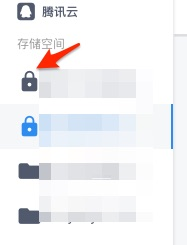

## 文件地址一直在变
这里您需要先去确认一下存储桶的[访问权限(以腾讯云为例)](https://cloud.tencent.com/document/product/436/13312#.E6.9D.83.E9.99.90.E7.B1.BB.E5.88.AB).

如果是`私有读写`，生成的url会带有相关鉴权的参数，所以看起来就像是一直在变.
如果是`公有读私有写`或`公有读写`，就不会有问题,直接返回的就是一个文件URL.

带锁的,就是私有读了.
::: tip
- `七牛云`目前没有获取存储桶状态的api,所以只能用户在设置页手动勾选.
- `awsS3` & `minIO` , 获取到的policy看不懂🤣,所以也做成了手动勾选.
::: 

## 图片资源被缓存
清除缓存 (菜单->设置->清除缓存)

## 七牛云开启原图保护后图片不显示
[什么是原图保护？](https://developer.qiniu.com/kodo/kb/1359/what-is-the-original-protection)

在应用中,为了节省流量和优化加载速度.七牛云的图片默认为会有一个图片样式(操作符/操作符参数形式的).

而开启原图保护后,只能使用`http://绑定域名/文件key或相对路径 + 已设定的样式分隔符 + 已设定的图片样式`来访问图片,所以导致应用中图片不显示.

这里需要用户手动设置一下.
例如:您已在七牛云后台设置了样式分隔符为'-',样式名称为'mobile'。
请在应用的设置->预览图片样式 中,填入'-mobile',保存.  
然后刷新应该就可以正常访问您开启了原图保护的空间图片了.